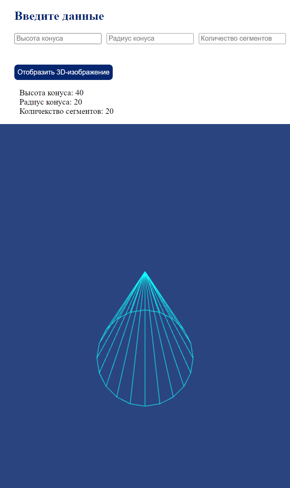

# CAD Exchanger

## 3D Конус

Это проект, который позволяет построить 3d изображение конуса по введенным параметрам пользователя.

В данном проекте используется библиотека three.js. Пользователь вводит данные конуса, далее отправляется запрос на сервер, на сервере вычисляется триангуляция конуса и по данным с сервера выполняется построение и отображение конуса на странице.

### Пример построения конуса

### Запуск и сборка проекта

Для запуска и сборки backend-части проекта необходимо перейти в директорию CAD api, затем выполнить команды: \
*npm install* \
*npm run dev* \
Порт для запуска backend-части проекта - 3000.

Для запуска и сборки фронтенд-части проекта необходимо перейти в директорию CAD, затем выполнить команды: \
*npm install* \
*npm run start* \
Порт для запуска фронтенд-части проекта - 3001.

### Node.js, three.js, JavaScript

